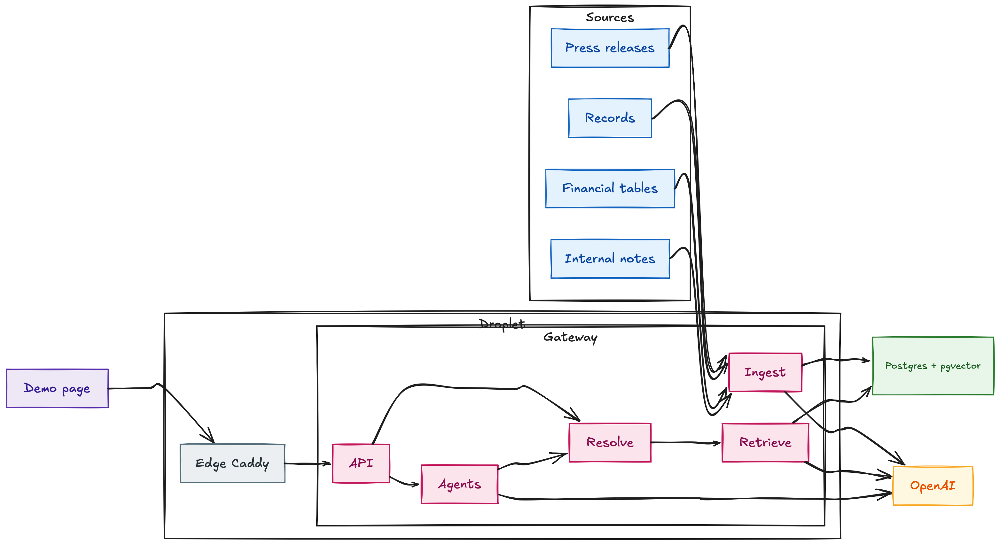
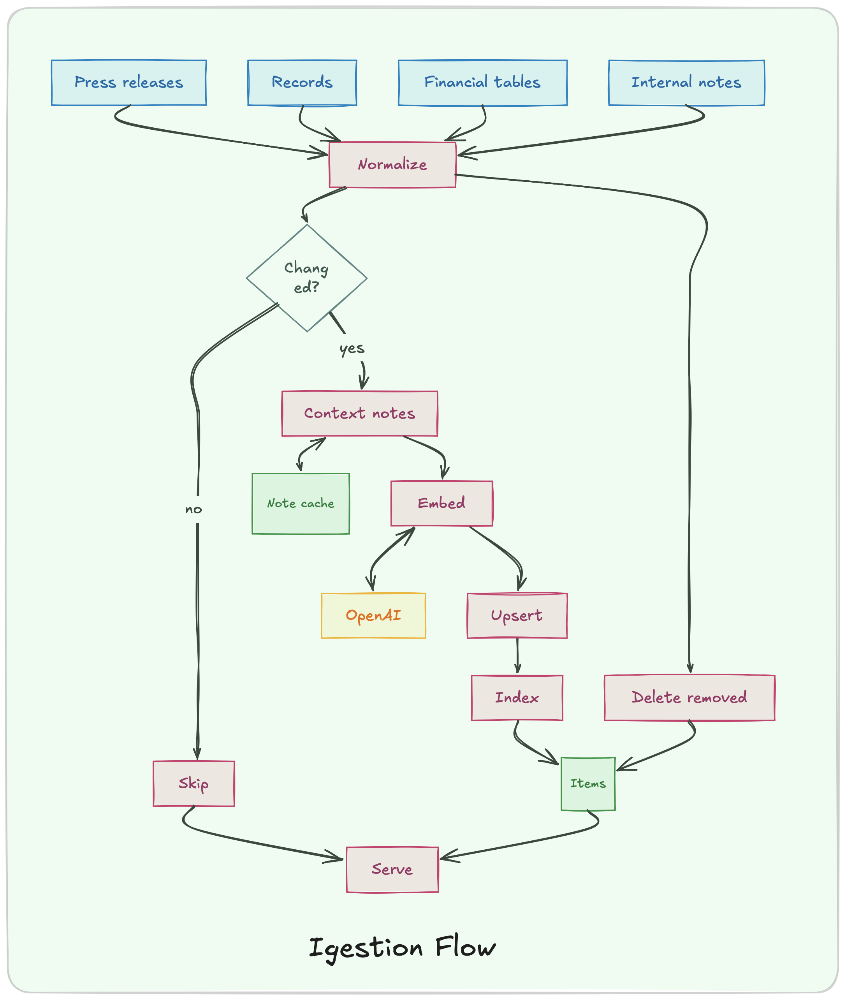
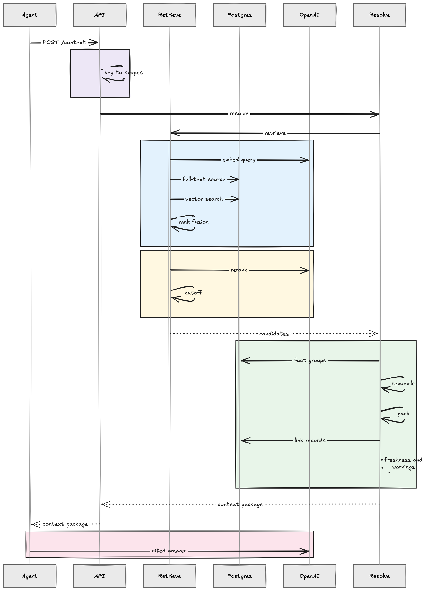

# Agent Context Gateway

A gateway through which an AI agent retrieves task-specific context from structured and unstructured sources. It returns the smallest useful package, with a citation and a reason for every item, and warnings for stale, missing, duplicated, or conflicting facts.

Live: [contextgateway.vaibhavkadam.online](https://contextgateway.vaibhavkadam.online). API docs at `/docs`.

## Problem and users

Agents that answer from company material tend to load everything they can find, cite nothing, and cannot tell a restated figure from a current one or a private draft from a public release. The users are the people who build such agents. They call one endpoint with a task and get back only what the agent needs, with provenance, freshness, confidence, and access scope already handled.

## System design



See also `AGENT_WORKFLOW.md` for how this was built and how to audit it, and `docs/BEST_INTERACTION.md` for the decision transcript that shaped the retrieval design.

| module | responsibility |
|---|---|
| `sources.py` | four adapters, one row shape |
| `ingest.py` | idempotent load, contextual notes, embeddings |
| `retrieve.py` | full-text and vector channels, rank fusion, LLM reranker |
| `resolve.py` | reconcile, pack, link, freshness, explain |
| `agents.py` | two PydanticAI agents on the same contract |
| `main.py` | API, key-to-scope auth, demo page |

## Sources

| source | kind | scope | confidence | timestamp |
|---|---|---|---|---|
| press release chunks | unstructured | public | 0.90 | date in text, else unknown |
| records | structured | public | 0.75 | same as the release |
| financial facts | structured | public | 0.85 | inferred from the quarter |
| internal notes | unstructured and structured | internal or private | 0.60 | message timestamp |

## Ingestion flow



## Query flow



`POST /context` with `X-API-Key` and `{task, budget_tokens, as_of}` returns:

- `items[]`: `ref`, `kind`, `title`, `content`, `fields`, `evidence[]`, `freshness`, `score`, `why[]`
- `warnings[]`: `stale`, `missing`, `duplicate`, or `conflict`, with refs and a resolution
- `scopes_applied`, `candidates_considered`, `tokens_used`, `budget_tokens`

`POST /agents/answer` and `POST /agents/brief` consume the same package and cite its refs.

## Requirement to mechanism

| requirement | mechanism |
|---|---|
| ingest and normalize several source types | four adapters into one `items` table |
| preserve reference, timestamp, freshness, confidence, scope | `source_ref`, `observed_at` with precision, confidence per source, scope column |
| smallest useful package | reranker cutoff, token budget, per-document cap, max items |
| combine structured and unstructured evidence | records attached to cited chunks, shared `fact_key` across sources |
| detect stale, missing, duplicated, conflicting facts | fact groups merged or resolved, age check, uncovered periods |
| filter private material before retrieval | scopes from the key, applied inside the SQL |
| citations with every fact | `evidence[]` on every item |
| explain inclusion | `why[]` on every item |

## Run

```bash
cp .env.example .env                                                          # leave OPENAI_API_KEY empty for the key-free path
docker compose -f docker-compose.yml -f docker-compose.local.yml up --build   # local Postgres, ingests, serves on :8002
python eval/run.py                                                            # writes eval/results/report.md
python -m pytest tests                                                        # offline checks, no database or key needed
```

Open `http://127.0.0.1:8002`, type a task, press Run. The page shows the package for all three access levels.

**Without an API key** the same commands run the core path deterministically: lexical retrieval, reconciliation, packing, warnings, and citations all work, and the agents return a cited extract of the package instead of a model answer. With a key, embeddings, contextual notes, the reranker, and the model-written agents switch on.

Production: `docker compose up --build` against the managed Postgres in `.env`, deployed with `scripts/deploy.sh`. The `data/` folder is not in git; see `data/README.md` for the layout.

## Evaluation

Six showcase tasks, a 100-question golden set, and both agents. Full packages in `eval/results/report.md`.

| metric | production | lexical-only |
|---|---|---|
| showcase checks | 6 of 6 | 5 of 6 |
| hit rate | 91% | 80% |
| document recall | 82% | 72% |
| MRR | 0.86 | 0.69 |
| refusals returned empty | 55% | 20% |
| attribution completeness | 100% | 100% |
| out-of-scope evidence | 0 | 0 |
| agent citation coverage | 100% | disabled |
| items per package | 3.4 | 4.0 |
| latency | 5.5 s | 69 ms |

Retrieval ablation:

| configuration | hit rate | recall | MRR | refusals | items |
|---|---|---|---|---|---|
| lexical only | 79% | 72% | 0.69 | 20% | 4.0 |
| lexical + dense | 90% | 79% | 0.76 | 0% | 5.8 |
| lexical + dense + reranker | 90% | 79% | 0.81 | 50% | 3.6 |
| contextual | 86% | 77% | 0.74 | 0% | 5.7 |
| contextual + reranker (default) | 91% | 81% | 0.86 | 55% | 3.4 |

## Evidence, provenance, confidence, approval

Every item carries one or more evidence records with the source, a stable reference, the observed timestamp and its precision, the ingest time, the scope, a confidence tied to how the content was produced, and a quote. Warnings carry the refs involved and a resolution. The gateway performs no write actions, so there is no human-approval step; the control point is the access scope, which is decided by the API key and applied before retrieval.

## Measuring in operation

The eval is the acceptance test. In operation, log per request: items returned, tokens used, candidates considered, warnings by kind, and the reranker scores of what was dropped. Watch three things: hit rate on a maintained golden set after each corpus change, the share of agent sentences that carry a citation, and zero evidence outside the caller's scopes.

## Assumptions

- Press releases are public, internal notes are internal or private, and the key decides the scope. Nothing is inferred from content.
- The most recent, most confident source wins a conflict. That matches restated financials, which is the conflict this corpus actually has.
- A press release's first full date is close to its publication date.
- The corpus's present is mid 2024, so the eval and the demo page judge freshness as of 1 July 2024.

## Tradeoffs

- OpenAI only. No second vendor and no hosted model, which ruled out late chunking and a cross-encoder. The LLM reranker took their place and measured better than the alternatives that were tried.
- The reranker costs about five seconds per request. Without it, packages are larger and off-corpus questions come back with weak matches.
- The plain and contextual indexes are both kept so the ablation stays reproducible, at the cost of two extra columns.
- Freshness thresholds and the reranker cutoff are fixed settings, not learned.

## Limits

- Most releases carry no full date; timestamps are labelled by precision.
- Facts inside prose are not extracted, only tabular facts and facts tagged in notes.
- Refusals: 45% of off-corpus questions still return related items the agent has to decline within.

## Next steps

- Extract facts from prose with a schema-guided pass at ingest, so conflicts in narrative text are reconciled too.
- Learn the reranker cutoff and freshness thresholds from labelled outcomes instead of fixing them.
- Add an approval hook for any future write-back, such as an agent proposing a correction to a record.
- Per-key rate limits and request logging to a table, so the operational metrics above are queryable.
